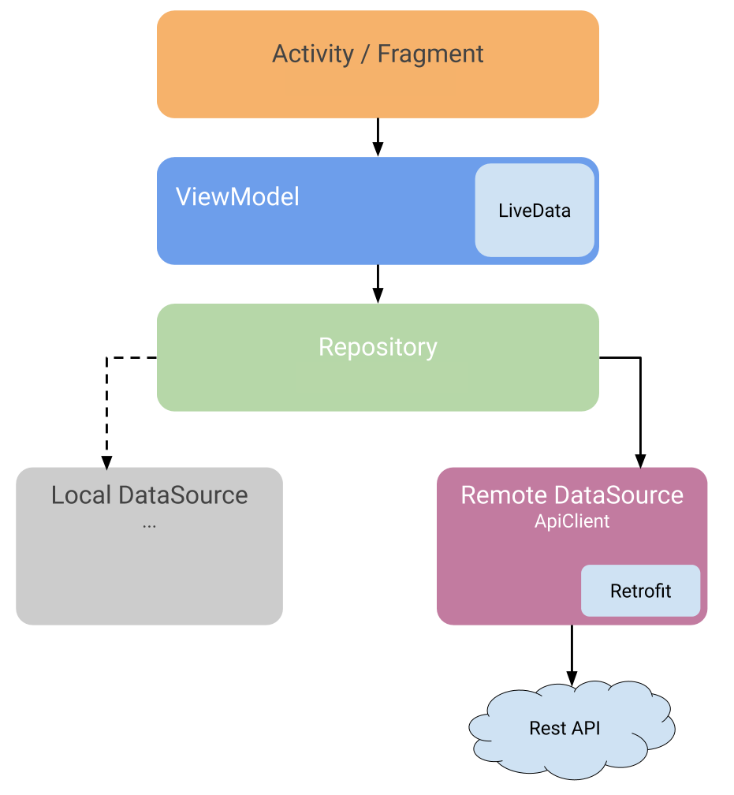

# Github Repository Listing App
This repository contains a simple GitHub repository listing app that implements MVVM architecture using Kotlin, ViewModel, LiveData, RxJava, Hilt and etc.

## Tech stack & Open-source libraries
- Minimum SDK level 24
- [Kotlin](https://kotlinlang.org/) based
- Hilt for Dependency Injection.
- JetPack
  - LiveData - notify domain layer data to views.
  - Lifecycle - dispose of observing data when lifecycle state changes.
  - ViewModel - UI related data holder, lifecycle aware.
- Architecture
  - MVVM Architecture (View - DataBinding - ViewModel - Model)
  - Repository pattern
- [Retrofit2 & OkHttp3](https://github.com/square/retrofit) - construct the REST APIs and paging network data.
- [Gson Converter](https://github.com/square/retrofit/tree/master/retrofit-converters/gson) - A Converter which uses Gson for serialization to and from JSON.
- [RxJava & RxAndroid](https://github.com/ReactiveX/RxAndroid) - Library to make writing reactive components in Android applications easy and hassle-free.

## The requirements
Create a simple app that will fetch and display all public repos from Google’s Github account.  

These are the basics:  

- Fetch the list of Google repos from the Github API (https://api.github.com/users/google/repos)  
- Display the list of all repos (name, description, etc…)  
- Selecting a repo will display detail information(stars, watchers, issue count, fork count)  
- Allow a drill-down to see all the issues.  
- Bonus(not required): Show the repo avatar.  

### The architecture

# MVVM Design Pattern (Model-View-ViewModel)

MVVM is a template of a client application architecture as an alternative to MVC and MVP patterns when using Data Binding technology. Its concept is to separate data presentation logic from business logic by moving it into particular class for a clear distinction.

**Why Promoting MVVM VS MVP:**
- ViewModel has Built in LifeCycleOwerness, on the other hand Presenter not, and you have to take this responsibly in your side.
- ViewModel doesn't have a reference for View, on the other hand Presenter still hold a reference for view, even if you made it as weak reference.
- ViewModel survive configuration changes, while it is your own responsibilities to survive the configuration changes in case of Presenter. (Saving and restoring the UI state)

**MVVM Best Practice:**
- Avoid references to Views in ViewModels.
- Instead of pushing data to the UI, let the UI observe changes to it.
- Distribute responsibilities, add a domain layer if needed.
- Add a data repository as the single-point entry to your data.
- Expose information about the state of your data using a wrapper or another LiveData.
- Consider edge cases, leaks and how long-running operations can affect the instances in your architecture.
- Don’t put logic in the ViewModel that is critical to saving clean state or related to data. Any call you make from a ViewModel can be the last one.

## How it works
As mentioned before MVVM breaks the app into components and they interact in a certain way. This interaction follows the pattern:
1. The View subscribes to a LiveData from a ViewModel
2. The ViewModel connects to a repository
3. The Repository connects to databases, both remote and local, if there
   are both
4. The Repository returns the requested data to the the ViewModel
5. The ViewModel formats the data and exposes it through a LiveData
6. The View's subscriptions are notified of any changes through the
   LIveData, and updates the UI to match